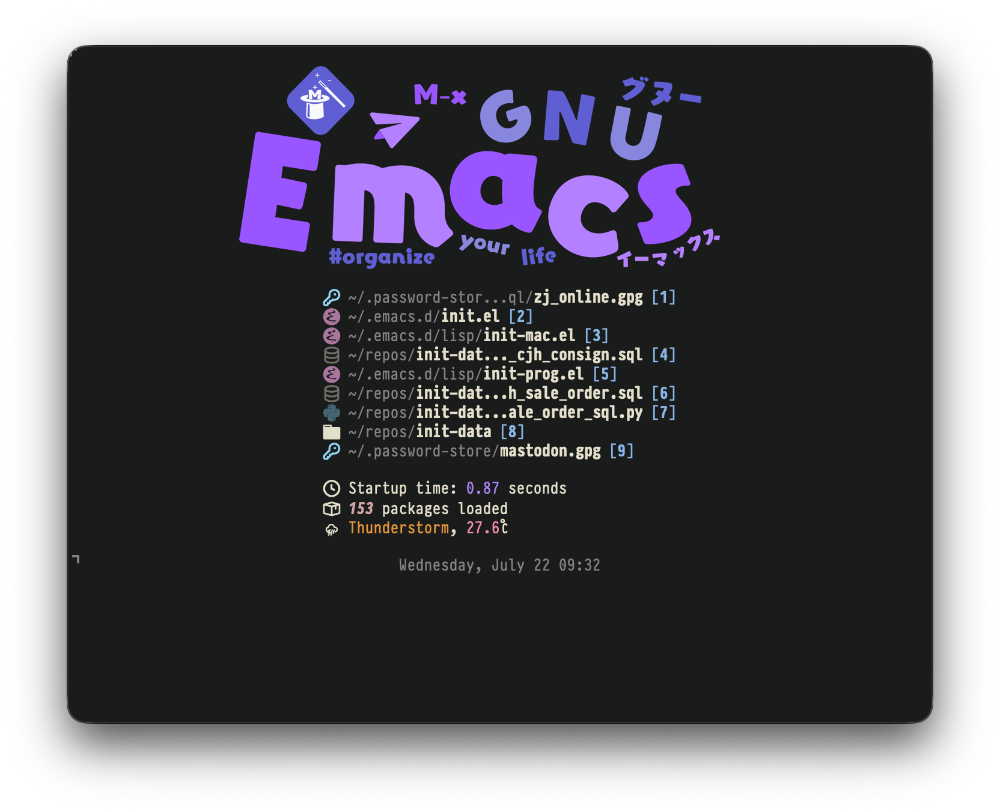

# panel

A small Emacs startup panel focused on recent files, startup info, and optional weather.



## What it does

- Shows up to 9 recent files with optional icons and keyboard actions.
- Shows the full path when point is on a recent file or the mouse hovers over
  its displayed path.
- Shows a terminal-friendly ASCII intro block by default in TTY Emacs.
- Shows startup time and loaded package count.
- Optionally shows current weather from Open-Meteo.
- Optionally shows a centered image.

## Requirements

- Emacs 28.1+
- [`nerd-icons`](https://github.com/rainstormstudio/nerd-icons.el) for file and
  status icons (optional but recommended)

`recentf`, ElDoc, and the URL library are built into Emacs.

## Installation

### `use-package` with `straight.el`

```elisp
(use-package panel
  :straight (:host github
             :repo "LuciusChen/panel")
  :config
  (panel-create-hook))
```

### Local checkout

```elisp
(add-to-list 'load-path "/path/to/panel")
(require 'panel)
(panel-create-hook)
```

Run `M-x panel-refresh` to open or refresh the panel immediately.

## Configuration

### Basic

All options are available through `M-x customize-group RET panel RET`.  They
can also be set from the init file, for example:

```elisp
(setq panel-title "Quick access"
      panel-show-file-path nil
      panel-time-format "%Y-%m-%d %H:%M")
```

`panel-time-format` accepts the standard format string understood by
`format-time-string`.  Set `panel-use-icons` to nil to force text fallbacks.

### Terminal intro

The intro block is rendered with plain text, so it works in terminal Emacs
without image support.

```elisp
(setq panel-intro-display 'tty
      panel-intro-lines
      '("┌─┐ ┌┬┐ ┌─┐ ┌─┐ ┌─┐"
        "├┤  │││ ├─┤ │   └─┐"
        "└─┘ ┴ ┴ ┴ ┴ └─┘ └─┘")
      panel-intro-help-lines
      '(("C-x C-f" . "find a file")
        ("C-h t" . "start the Emacs tutorial")
        ("q" . "close this panel")))
```

- `panel-intro-display`: show the intro in `tty`, `always`, or `never`.
- `panel-intro-lines`: override the ASCII logo lines.
- `panel-intro-horizontal-offset`: shift the top header horizontally.  Affects
  both the TTY intro and the graphical image.
- `panel-intro-help-lines`: override the key hints shown below the logo.

### Weather

Set both coordinates to enable weather. Negative values are valid.

```elisp
(setq panel-latitude 31.2304
      panel-longitude 121.4737)
```

Weather is fetched directly from Open-Meteo with Emacs's built-in URL library;
redirects are not followed.  Updates and retries run while the panel is
visible.  Timing and retry options are available in the `panel` Customize
group.

### Image

If `panel-image-file` points to an image format supported by Emacs, it is shown
above the recent-files list in graphical Emacs.

```elisp
(setq panel-image-file "~/Pictures/panel.png"
      panel-image-width 200
      panel-image-height 200)
```

## Keybindings

- `RET`: open the recent file on the current line
- `o`: open the recent file on the current line
- `d`: forget the recent file on the current line without deleting it
- `1`..`9`: open recent file by index
- `M-s-1`..`M-s-9`: open recent file by index
- `g`: refresh panel
- `r`: refresh panel

## Notes

- The panel buffer is `*panel*`.
- Set `panel-show-file-path` to nil to hide directory prefixes in recent-file
  entries.
- Missing files are shown in the list and opening them reports a user error
  instead of creating a new buffer.
- Rendering or forgetting remote recent-file entries does not connect to the
  remote host; opening one explicitly enters TRAMP.
